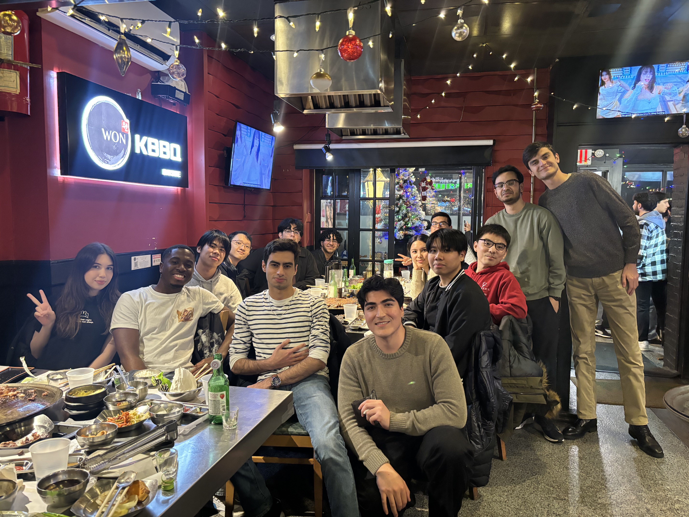
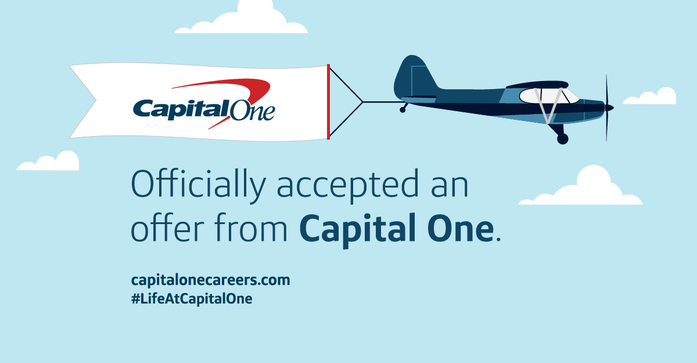

# How I got Capital One
### *02/12/2025*

## Reason why I'm making this blog post

I want to write about what I did to get myself in this fortunate position ( *The position being, landing a internship at Capital One for Software Engineering* ). This blog post will be especially interesting for those who are looking for a Software engineering internship and are currently in a position of wanting to make themselves a competitive candidate for these roles.

## My Background
For context I got my offer back in early September ( I know I'm late to making a post ). This is important because what helped me land my offer was not what I was doing during my interviewing process with Capital One but what I was doing before the application cycle started. 

The previous cycle I had no luck whatsoever with landing anything. I had applied to over 200+ companies and nothing. What was different from then and now was back then, I had no knowledge of how to land an internship. I had no idea what a good resume was suppose to look like and I had no idea what a good project was suppose to look like. This time around I knew what to expect and I prepared for it.

After that cycle starting around February I started to do a leetcode a day. I know this isn't the most unheard of advice but what I want to point out is that I started nearly an entire year before. 
I had time to improve on my data structures and algorithms and I took time to improve my resume and my projects.

### Key Takeaway
If you're looking to land a internship at a big company like Capital One, start early.

## Valuable information 
So what I just mentioned is the obvious advice, know what to do and do it. The advice of value I want to provide is **how I did it**.

### Community

I am a part of a student club in CUNY Queens College called Code For All, and truly without a community in this market you just won't be operating at your best. The flow of information from a community is invaluable. You get to know whats working for students and what's not working. In a market thats evolving pretty fast, you need some manner to keep up. 
Join a club, or discord and honestly join my clubs discord [Code For All](https://discord.gg/aWvjdVQeV2)

### Peers to practice interviews 
Aside from getting your resume together, improving it, applying early, and reaching out to connections, there isn't much else you can do.

So thats why I'm urging the importance of practicing interviews with your peers. The worst feeling is hyper focusing on getting an interview, succeeding on that and then failing the interview because you weren't adequately prepared.

### Projects

[Code For All Website](https://www.codeforall.nyc/)

I can't tell you what to make but I can tell you the most bang for my buck was making web development projects. I learned React and made a few projects with it and I **deployed them**(!important). 

### What resources I used specifically
For myself I was fortunate enough to get into a year long program called CUNY Tech Prep, that gave me access to career coaching and a mentor. On top of that I was able to get mock interviews for both technical and behavioral interviews. 

This was huge for me, because I also did mocks with my peers and at one point, I used
[Pramp](https://www.pramp.com/) for mock interviews.

For projects, go ahead and do yourself a favor and learn [React](https://react.dev/), [Clerk](https://clerk.com/) and [Vercel](https://vercel.com/). These are the tools that will get you started on the right foot!

### Conclusion
I hope this blog post was helpful to you. I hope I was able to provide some value to you. If you have any questions feel free to reach out to me on my [LinkedIn](https://www.linkedin.com/in/jonnathan-saavedra/). I'm always happy to help out a fellow student. 

