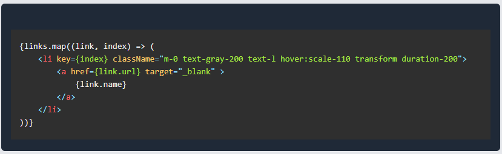

# My First Blog 
### *7/14/2024*
## Introduction

Hi, my name is Jonnathan. Get ready to read a most likely mediocre blog post because this is, as you probably read in the title, my first blog post. Moving to the content, my idea with my first blog post is to speak about my experience creating this blog. To keep it organized, I will be dividing it into sections. The first section will speak about why I started a blog. The second section will speak about my plan for the blog and how I accomplished it. The last section will speak about the problems I faced and hopefully provide some helpful insights into solving problems you might face when creating a blog.

## Why am I a blogger?
1. **System of success**: There is an amazing quote that goes, "you don't rise to the level of your goals, you fall to the level of your systems." My understanding of this quote is that I shouldn't be focusing on achieving the goals I have but instead staying afloat on a path that in time will get me to reach my goals. A blog will be a part of my system.

2. **To work on a project**: I'm in college, and I want to get better at software development. Outside of internships, working on projects headfirst is the best method to get better. So I chose a simple project and picked out the technologies I wanted to learn, those being React-Vite, TypeScript, and [Tailwind](https://tailwindcss.com/docs/installation)

3. **Opportuntity to show growth**: The vision is my blog will demonstrate where I started and how far I have gone from there. A blog is a great platform to showcase what I have learned over time and what I am currently achieving. It's also a great way for me to work on my writing abilities.

## My Vision
I took some time exploring different blogging sites to really get a vision of what I want my blog to look like. My vision was for my website to focus on the writing itself. I didn't want to take away from the writing with random animations or an eye-catching UI. That's when I saw the vision for my blog: it was going to be a functionally efficient blog so that when I make a new blog post, I don't have to write hundreds of lines of code to publish a new blog page. I created the header to take in properties so if I want to make a new page with a different title or different links, I can. The links would be dynamically mapped using this code.
```html
{links.map((link, index) => (
    <li key={index} className="m-0 text-gray-200 text-l hover:scale-110 transform duration-200">
        <a href={link.url} target="_blank" >
            {link.name}
        </a>
    </li>
))}
```
Following that pattern, I did the same for the blog descriptions on the home page. Each one of those blog descriptions is mapped onto the home page by giving the properties to a blog card component.
```html
{blogs.map((blog, index) => (
    <BlogCard
        key={index}
        title={blog.title}
        link={blog.link}
        description={blog.description}
        date={blog.date}
    />
))}
```
The main pride in my blog is the dynamic routing of the blog pages. I read about how bloggers' biggest issue with managing their website is the lack of ease of use when making a new blog post. Using React, I knew there was some way to make this more efficient. My plan, after iterations of trial and error, boiled down to using markdown files as the blog content and dynamically fetching the markdown files using the URL paths. Every blog post will have an ID that will be used as the URL path and will be used to fetch the markdown file to display the content. The concept is simple but was difficult to find a solution for. What I did was use the [React Markdown](https://github.com/remarkjs/react-markdown) component to turn my markdown, that I fetched dynamically, into text. Then I created a container for the markdown to display nicely, and that should have been it, but sadly not because then came some problems.

## My problems:

First up, I had a conflict with React Markdown and Tailwind. The pretty markdown that I pictured just wasn't there; I at first had no clue what the issue was, but then I found out that I could fix it with a neat plugin. The [Tailwind Typography plugin](https://github.com/tailwindlabs/tailwindcss-typography) allowed me to fix the lack of styling on my markdown content, specifically using the [prose](https://docs.storefrontui.io/v2/customization/prose).
This fixed most of my problems. The markdown code box syntax highlighter was just not showing up. It would only create a box without any syntax highlights. After researching a solution, I found out about [react-syntax-highlighter](https://github.com/react-syntax-highlighter/react-syntax-highlighter). This finally gave syntax highlighting, but the Tailwind prose was creating a box, and the syntax-highlighter was also creating a box. The result is below.

The issue was now solving the conflict between the prose class and the syntax-highlighting component. This by far was the most difficult problem to overcome; when I would try to target the CSS in the syntax highlighter, the only result I got was code with a white odd-looking background. After researching, I found out that the syntax highlighter pre tags the code block HTML with a 'pre' HTML element. Changing this to a div element blocked the prose class from styling the code block, leaving only the react-syntax-highlighter styling the code block.
```html
 <ReactMarkdown children={markdown} className=""
    components={{
        pre: "div",  //THIS is needed because prose styles pre tags but not divs
        code({ node, className, children, ...props }) {
            const match = /language-(\w+)/.exec(className || '');
            return match ? (
                <div className="not-prose"> {/*This gets rid of backtick ?? still unknown why*/}
                    <SyntaxHighlighter
                        children={String(children).replace(/\n$/, '')}
                        style={materialDark}
                        language={match[1]}
                        PreTag="div"
                        {...props}
                    />
                </div>
            ) : (
                <code className={className} {...props}>
                    {children}
                </code>
            );
        }
    }}
/>
```

## Ending Remarks
I am extremely proud of how my blog turned out. I plan on making more blogs over the years and improving the website over time. I wanted to give a special thanks to TurtleArmy, a software engineer who helped me along with finding my solutions to my problems. Thank you very much for reading!